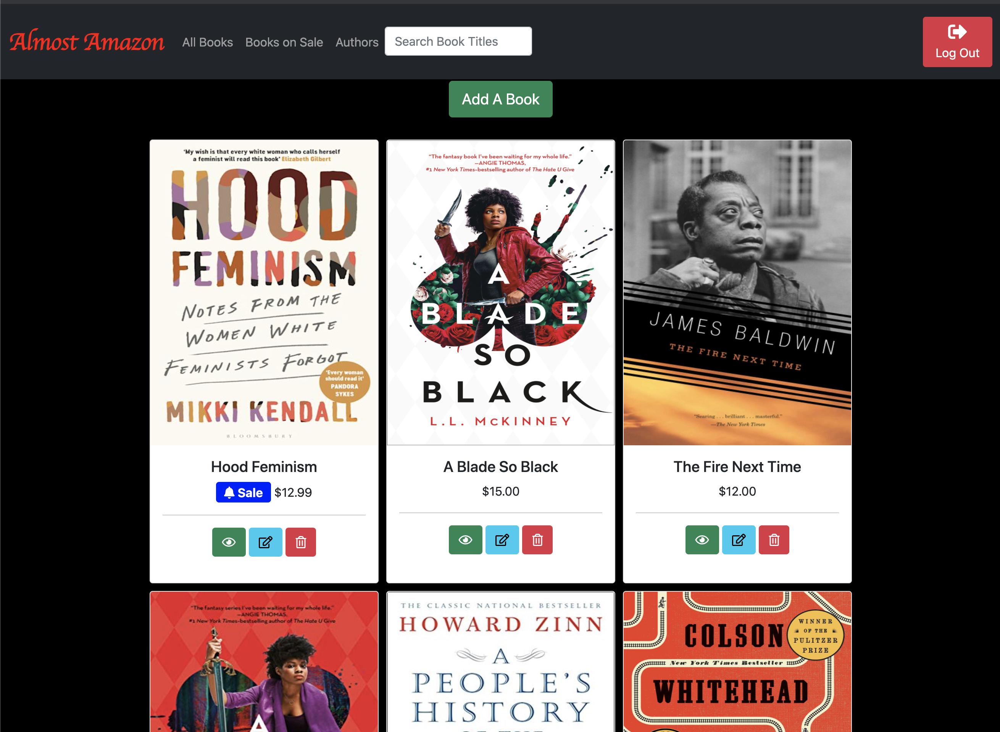

# Almost Amazon
We are building an admin app that allows a store owner to login to the app and manage books and authors.

[User Restricted Deplyed Sample](https://almost-amazon-webpack5.netlify.app/#)



We will be learning about the following:
- XHR requests
- Promises
- Firebase
- ERDs
- Postman
- CRUD

## Get Started
- Clone your repo
- Install app dependencies: `npm i`
- Start your server: `npm start`
  - The server starts the only error you should see is this one (which will be fixed after the Firebase Walkthrough is completed):
    ```js
    {
      code: "auth/invalid-api-key",
      message: "Your API key is invalid, please check you have copied it correctly.",
      a: null
    }
    ```
- Change `.sample.env` file name to `.env`


## TODO 1 - Get Setup
In preparation for next week, complete the following in lab:
- [Firebase Walkthrough Videos ~15 minutes](https://vimeo.com/showcase/codetracker-firebase)
  - Create a project called `Almost Amazon`
  - Add a Realtime Database
  - Create an app called `Almost Amazon`
  - Add Auth
  - Add the Keys to your `.env` file
  - Upload the sample data to Firebase
- Test the Firebase Setup
  - Start and stop your server
  - Go to the application it should look like this:
 
  
 
  - The API key error should also be gone
  - Clicking the button should open up a Google Popup. Select a user to sign in with.

  
    
  - After signing in, there should be a Navbar
    - If your screen size is small, the Navbar might be collapsed like in the image below. Click on the hamburger button to open it.
 
  
  
  - Click on the Log Out Button

 
      
  
  - This should bring back the Login Button

## TODO 2 - Look at the Code...
  - Take a look at the layout of the application. Start in `main.js` and follow the flow to get up to speed.
    - Look at the components, events, helpers, and views
    - Checkout `main.scss` 

## TODO 3 - Installs
- Install [Postman](https://www.postman.com/downloads/)

## Technologies used
- Javascript
- Firebase Auth
- Firebase Realtime Database
- Axios for XHR requests
- SASS (For your own exploration)
- Bootstrap 5
- Webpack 5
